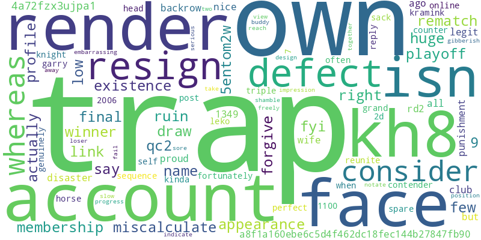

# Reddit: Analysis of Langauge Patterns through Regularization

## Introduction

Welcome to my project! The primary goal of this project is to analyze Reddit posts and their corresponding upvotes using various regression models. My aim is to identify the relationship between the textual features of posts, such as their term frequency-inverse document frequency (TF-IDF), and their popularity as indicated by the number of upvotes.

I have structured the project to facilitate the entire process, from data acquisition to model evaluation. I provide a streamlined pipeline that enables users to easily download data from specified subreddits, preprocess the data to extract relevant features, train a variety of regression models, and evaluate their performance using several metrics.

In the subsequent sections, I will guide you through the setup and execution of the project, including a detailed explanation of the project structure, how to run the code, and the metrics used for evaluating model performance. Additionally, I provide a list of references to further explore the underlying concepts and algorithms employed in this project.

## Project Structure

```
├── datasets             <- Folder for storing datasets
|   ├── raw              <- Unprocessed data from subreddits: posts and upvotes
|   └── clean            <- TF-IDF of posts packed with upvote numbers
|
├── evaluation           <- Folder for metric tables and other visualization artifacts
├── refs                 <- Paper references for regularization algorithms
├── src                  <- Source code of the project (all scripts)
├── weights              <- Folder with serialized models
|
├── .gitignore           <- List of ignored files and directories
└── requirements.txt     <- List of dependencies of the project
```

## How to run?

1. Install the project dependencies:

```pip install -r requirements.txt```

2. The project uses [Reddit API](https://www.reddit.com/dev/api/) and relies on having `.env` file with the following variables:

|       Variable      | Description |
| ------------------- | ----------- |
| `REDDIT_APP_ID`     | Application ID on reddit dev portal               |
| `REDDIT_APP_SECRET` | Secret token for interaction with dev application |
| `REDDIT_APP_NAME`   | Alias of the reddit dev application               | 
| `REDDIT_USERNAME`   | Your username                                     |
| `REDDIT_PASSWORD`   | Your password                                     |

3. Download datasets from subreddits. You can specify any subreddits of your like as long as they exist:

```
python src/parse.py --sub-reddits [SUB_REDDIT_NAMES] 
                    --output-dir <folder_for_data> 
                    --env <path_to_env>
```

4. Once you have downloaded posts from your favourite sub-reddits, preprocess them to extract TF-IDF features:

```
python src/preprocess.py --input-dir <folder_with_raw_datasets> 
                         --output-dir <folder_to_output>
```

5. Once the data is preprocessed, you can train a bunch of simple regression models with one line:

```
python src/train.py --datasets-dir <processed_datasets_dir> 
                    --weights-dir <folder_to_save_weights>
```

6. Once the models were trained, you can run inference on them, compute the table of metrics, and draw the the word clouds to visualize important words to get more upvotes:

```
python src/evaluate.py --datasets-dir <processed_datasets_dir> 
                       --weights-dir <weights_folder> 
                       --output-dir <folder_to_save_artifacts>
```

## Visualization

Examples of words that positively correlate with number of upvotes in [/r/MachineLearning](https://www.reddit.com/r/MachineLearning/):


Examples of words that negatively correlate with number of upvotes in [/r/chess](https://www.reddit.com/r/chess/):



## Metrics

<table>
    <thead>
        <tr>
            <th rowspan=2></th>
            <th colspan=3>MachineLearning</th>
            <th colspan=3>cscareerquestions</th>
            <th colspan=3>compsci</th>
            <th colspan=3>chess</th>
            <th colspan=3>python</th>
        </tr>
        <tr>
            <th>MSE</td>
            <th>$\| \mathbf{w} \|_1$</th>
            <th>$\| \mathbf{w} \|_2$</th>
            <th>MSE</td>
            <th>$\| \mathbf{w} \|_1$</th>
            <th>$\| \mathbf{w} \|_2$</th>
            <th>MSE</td>
            <th>$\| \mathbf{w} \|_1$</th>
            <th>$\| \mathbf{w} \|_2$</th>
            <th>MSE</td>
            <th>$\| \mathbf{w} \|_1$</th>
            <th>$\| \mathbf{w} \|_2$</th>
            <th>MSE</td>
            <th>$\| \mathbf{w} \|_1$</th>
            <th>$\| \mathbf{w} \|_2$</th>
        </tr>
    </thead>
    <tbody>
        <tr>
          <td>OLS</td>
          <td>7533</td>
          <td>246714</td>
          <td>4667</td>
          <td>2289</td>
          <td>404979</td>
          <td>7031</td>
          <td>13358</td>
          <td>118967</td>
          <td>2617</td>
          <td>96576</td>
          <td>488819</td>
          <td>9240</td>
          <td>195</td>
          <td>231517</td>
          <td>171875</td>
        </tr>
        <tr>
          <td>Lasso</td>
          <td>13118</td>
          <td>68490</td>
          <td>2617</td>
          <td>10338</td>
          <td>71677</td>
          <td>2843</td>
          <td>16956</td>
          <td>33002</td>
          <td>1582</td>
          <td>115069</td>
          <td>92971</td>
          <td>3845</td>
          <td>2867</td>
          <td>25540</td>
          <td>1383</td>
        </tr>
        <tr>
          <td>Ridge</td>
          <td>45551</td>
          <td>7539</td>
          <td>293</td>
          <td>36757</td>
          <td>5623</td>
          <td>176</td>
          <td>35423</td>
          <td>6740</td>
          <td>335</td>
          <td>177142</td>
          <td>6916</td>
          <td>322</td>
          <td>9360</td>
          <td>4064</td>
          <td>120</td>
        </tr>
    </tbody>
</table>

## References

* [Zhang, C. H., & Zhang, T. (2012). A general theory of concave regularization for high-dimensional sparse estimation problems.](https://projecteuclid.org/journals/statistical-science/volume-27/issue-4/A-General-Theory-of-Concave-Regularization-for-High-Dimensional-Sparse/10.1214/12-STS399.pdf)
* [James Briggs (2020). How to Use the Reddit API in Python](https://towardsdatascience.com/how-to-use-the-reddit-api-in-python-5e05ddfd1e5c)
